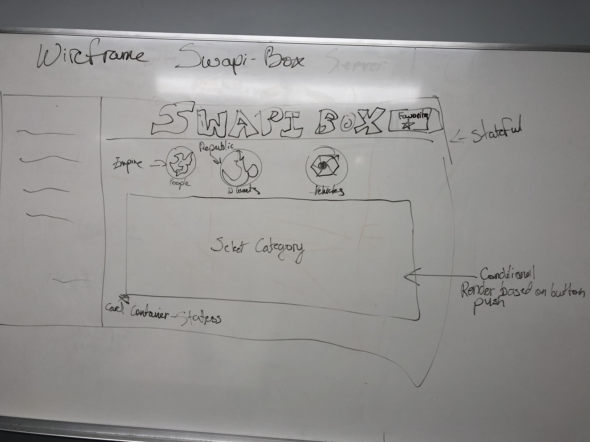
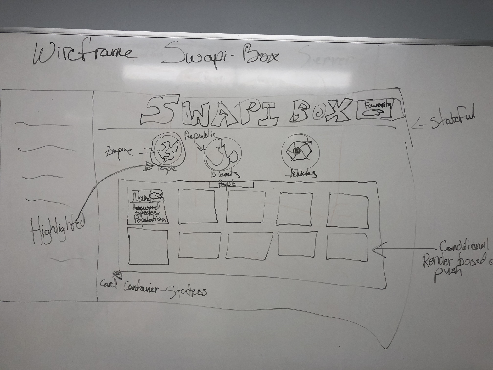
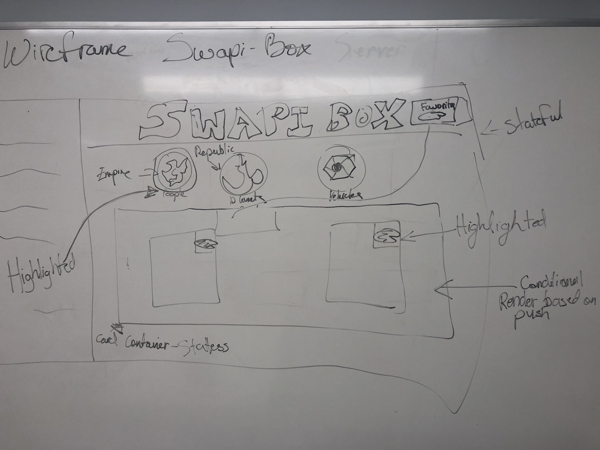
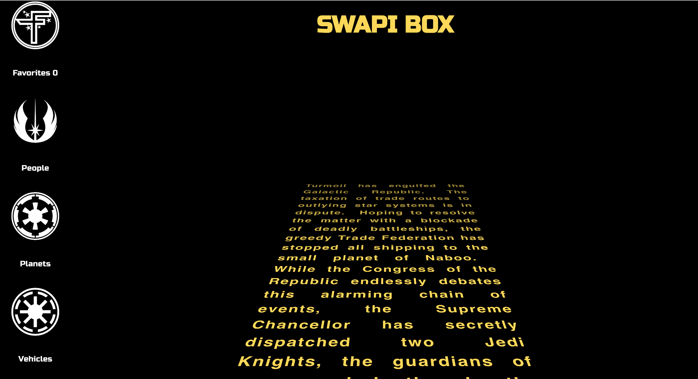
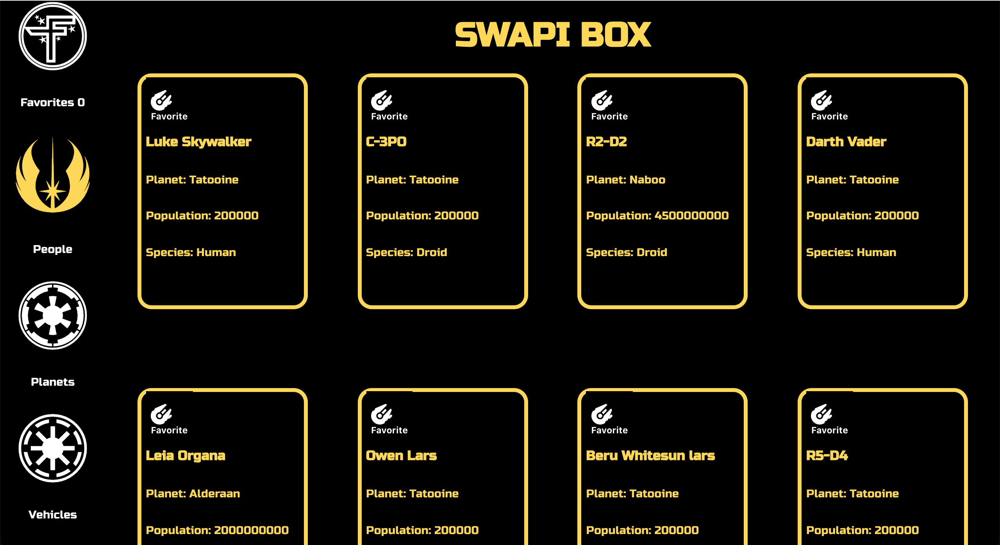
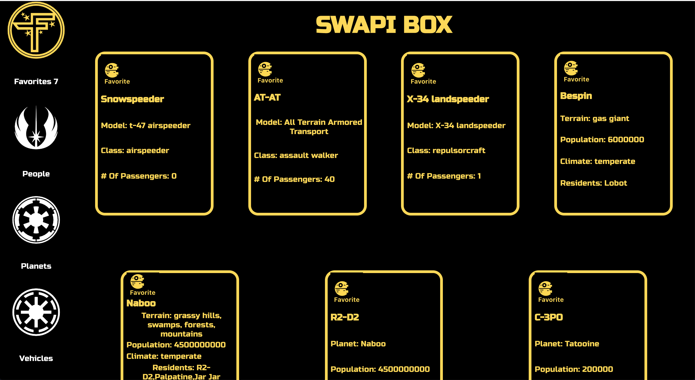

# Swapi-Box

## Created by Ben Hayek & Tim Garrity

### Description: Search your favorite Star Wars lore with the click of a button!This application query's the Star Wars API using asynchronous fetch calls in order to create cards with info on people, planets, and vehicles. The user can favorite cards which are stored in the favorites component to view upon later use. Local storage is taken advantage of to minimize calls to the API and increase loading time. 

## Technologies Used
* React
* React-Router
* Enzyme
* Jest

## Project Goals
* Pull in Star Wars info from Star Wars API.
* Favorite cards and store them in a component.
* Save data to local storage.
* Keep count of number of cards in favorites.
* Route changes in browser depending on page currently being viewed.
* Scroll random movie intro based on movie crawl in films.

## Set up Instructions
### Clone down Repo
### NPM install
### NPM start
### Visit localhost:3000
### Test with NPM test

### Wireframe

### Images from App

